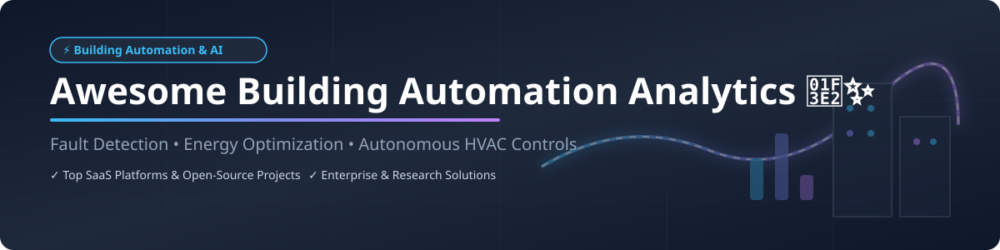

# Awesome Building Automation Analytics 🏢⚡

  
  
  
  
  

## 📌 Top Building Automation Analytics Ecosystem 🚀

**Curated List of SaaS Platforms & Open-Source GitHub Projects**  
*Focused on Fault Detection & Diagnostics (FDD), Energy Optimization, Smart EMS & Autonomous Building Controls*  

📅 **Last updated:** September 2026

---

### 💡 Overview & Market Landscape

This repository tracks top-tier **SaaS platforms** and **open-source projects** designed for **Building Automation Analytics**, **Building Energy Management Systems (BEMS)**, and **IoT Smart Buildings**. These software solutions continuously monitor commercial building equipment performance, detect equipment operational faults, optimize HVAC and lighting energy consumption, and automate facility management workflows.

---

## 📑 Table of Contents

- [🏢 SaaS & Commercial Platforms](#-saas--commercial-platforms)
- [💻 Open-Source GitHub Projects](#-open-source-github-projects)
- [🤝 How to Contribute](#-how-to-contribute)
- [☕ Support & Community](#-support--community)
- [⚠️ Disclaimer](#%EF%B8%8F-disclaimer)
- [📈 Star History](#-star-history)

---

## 🏢 SaaS & Commercial Platforms

> **📊 Market Size & Industry Structure:**  
> The global **Building Automation Systems (BAS) & Smart Building Analytics Market** is estimated at **\$85.2 Billion in 2026** and projected to surpass **\$140 Billion by 2030** (CAGR ~10.5%). The market is **moderately fragmented**, with legacy industrial conglomerates (Johnson Controls, Honeywell, Schneider Electric, Siemens) holding enterprise dominance, while agile AI-first SaaS startups (BrainBox AI, Facilio, 75F) capture rapid market share in autonomous HVAC control and smart operations.

| Product | Enterprise Scale / Valuation / Revenue 💰 | Starting Pricing 💵 | Free Tier / Trial Limit 🎁 | Description & Core Features ⚡ |
| :--- | :--- | :--- | :--- | :--- |
| **[OpenBlue Enterprise Manager](https://www.johnsoncontrols.com/openblue)** | **\$38.5 Billion** Valuation ($22B+ Revenue) | \$500 / building / month | 30-Day Guided Enterprise Demo | Johnson Controls' enterprise building AI platform with generative AI insights, predictive energy optimization, and continuous FDD across 130+ asset categories. |
| **[BrainBox AI](https://www.brainboxai.com/)** | **\$250 Million** Valuation ($15M+ Revenue) | \$300 / building / month | 14-Day Free HVAC Efficiency Audit | Autonomous AI engine using deep learning to optimize existing commercial HVAC systems, cutting energy consumption by up to 25%. |
| **[Facilio](https://facilio.com/)** | **\$180 Million** Valuation ($12M+ Revenue) | \$250 / building / month | 14-Day Enterprise Free Trial | IoT-driven connected building operations platform unifying property maintenance, energy analytics, and ESG compliance. |
| **[Clockworks Analytics](https://www.clockworksanalytics.com/)** | **\$120 Million** Valuation ($10M+ Revenue) | \$200 / building / month | 30-Day Free Pilot Program | Automated Fault Detection and Diagnostics (FDD) platform identifying root-cause mechanical issues and energy waste across HVAC infrastructure. |
| **[GridPoint](https://www.gridpoint.com/)** | **\$100 Million** Valuation ($25M+ Revenue) | \$150 / location / month | 30-Day Free Facility Energy Assessment | Smart building technology platform automating demand response, sub-metering energy analytics, and HVAC efficiency for commercial chains. |
| **[BuildingMinds](https://www.buildingminds.com/)** | **\$90 Million** Valuation ($8M+ Revenue) | \$400 / portfolio / month | 14-Day Free Portfolio Demo | Real estate data platform driven by Schindler Group unifying real-time building performance, carbon footprint tracking, and ESG reporting. |
| **[75F](https://www.75f.io/)** | **\$75 Million** Valuation ($9M+ Revenue) | \$99 / zone / month | 30-Day Risk-Free Hardware/Software Trial | Wireless IoT building management system providing dynamic airflow balancing, occupant comfort optimization, and smart thermostat control. |
| **[Switch Automation](https://www.switchautomation.com/)** | **\$60 Million** Valuation ($6M+ Revenue) | \$180 / building / month | 14-Day Platform Access Trial | Cloud smart building platform integrating IoT sensor data, automated utility tracking, and fault diagnostics for property portfolios. |
| **[CopperTree Analytics](https://www.coppertreeanalytics.com/)** | **\$45 Million** Valuation ($5M+ Revenue) | \$150 / building / month | 30-Day Free Energy Diagnostic Trial | Building energy analytics & FDD platform delivering energy audits, baseline tracking, and rule-based system performance monitoring. |
| **[Enertiv](https://www.enertiv.com/)** | **\$35 Million** Valuation ($4M+ Revenue) | \$120 / building / month | 14-Day Free Operational Assessment | Operational IoT platform digitizing equipment maintenance, tenant sub-metering billing, and real-time power monitoring for commercial real estate. |

---

## 💻 Open-Source GitHub Projects

These open-source repos provide building operating systems, semantic metadata schemas, HVAC simulation tools, and reinforcement learning control frameworks for developers and researchers.

| Repository | Stars ⭐ | Primary Tech Stack 🛠️ | Description & Key Use Cases 🚀 |
| :--- | :---: | :--- | :--- |
| **[VOLTTRON](https://github.com/VOLTTRON/volttron)** |  | Python, ZeroMQ | Department of Energy (PNNL) open-source agent execution platform for building automation, microgrids, and IoT device integration. |
| **[Brick Ontology](https://github.com/BrickSchema/Brick)** |  | Python, RDF, Turtle | Universal metadata schema and ontology for modeling building assets, sensor points, HVAC relationships, and digital twins. |
| **[Home Assistant Core](https://github.com/home-assistant/core)** |  | Python, Asyncio | Open-source home and small commercial building automation operating system tracking energy monitoring, BACnet/MQTT sensors, and local control. |
| **[EnergyPlus](https://github.com/NREL/EnergyPlus)** |  | C++, Fortran | National Renewable Energy Laboratory (NREL) whole-building energy simulation engine for modeling heating, cooling, lighting, and ventilation. |
| **[Smart Core BOS](https://github.com/smart-core-os/sc-bos)** |  | Go, Vue.js, gRPC | Open-source building operating system for connecting building networks, running control automations, and securing RBAC device access. |
| **[Mortar](https://github.com/gtfierro/mortar)** |  | Go, Brick Ontology | Open-source testbed platform combining Brick metadata schemas with high-throughput timeseries telemetry for building analytics research. |
| **[DRL-BEMS](https://github.com/AIS-Clemson/DRL-BEMS)** |  | Python, PyTorch | Deep Reinforcement Learning framework for multi-VAV office HVAC energy management achieving up to 37% energy reduction. |
| **[Asuna](https://github.com/lauslim12/Asuna)** |  | Next.js, Express, MongoDB | Modular building management system designed for workspace bookings, multi-role admin controls, energy revenue, and visitor management. |
| **[ACTIVE](https://github.com/SmithRWORNL/ACTIVE)** |  | Python, Modelica | Oak Ridge National Laboratory (ORNL) testbed framework for integrating, verifying, and emulating AI building control strategies. |
| **[OpenBuildingControl (OBC)](https://github.com/lbl-srg/modelica-buildings)** |  | Modelica, Python | LBNL repository implementing ASHRAE Guideline 36 standardized HVAC control sequences for performance verification. |
| **[Brick Ontology Service](https://github.com/Pamekitti/brick-ontology-service)** |  | FastAPI, RDFLib | RESTful microservice for querying and managing building SPARQL graphs and RDF models using Brick ontology. |
| **[EcoSync](https://github.com/kimdain0222/ecosysnc)** |  | React, FastAPI, PostgreSQL | Smart Building Energy Management System analyzing campus occupancy to automatically regulate HVAC and lighting systems. |
| **[Energy Management Facilities](https://github.com/Kokonelas/Energy_Management_In_Building_Facilities)** |  | Java, Spring Boot | Modular Java application simulating smart facility microservices including solar PV control, water monitoring, and HVAC automation. |

---

## 🛠️ Frameworks for Building Custom Analytics Pipelines

When engineering a custom vendor-independent building automation analytics solution, consider combining these open-source tools:
1. **Semantic Metadata Layer:** Use **[Brick Ontology](https://github.com/BrickSchema/Brick)** to map building sensors, physical spaces, and HVAC equipment relationships.
2. **Telemetry Integration:** Integrate **[Mortar](https://github.com/gtfierro/mortar)** or **[VOLTTRON](https://github.com/VOLTTRON/volttron)** to stream real-time IoT sensor data (BACnet, Modbus, MQTT).
3. **Control Standard Verification:** Apply **[OpenBuildingControl](https://github.com/lbl-srg/modelica-buildings)** to benchmark HVAC sequences against ASHRAE Guideline 36.
4. **AI & RL Control Optimization:** Leverage **[DRL-BEMS](https://github.com/AIS-Clemson/DRL-BEMS)** or **[ACTIVE](https://github.com/SmithRWORNL/ACTIVE)** for testing machine learning control policies before deployment.

---

## 🤝 How to Contribute

Contributions are highly welcomed! Help us keep this directory accurate and up to date.

1. Fork this repository.
2. Create a new feature branch (`git checkout -b feature/add-new-tool`).
3. Add or update tool details in `README.md` keeping descriptions factual.
4. Submit a Pull Request with a clear description of changes.

---

## ☕ Support & Community

If you find this repository helpful, please consider supporting the project:

- ⭐ **Star this repository** to show your appreciation!
- 🔀 **Fork & Share** with your fellow building automation engineers, energy managers, and facility analysts.
- 💖 **Sponsor the Maintainer:** Consider buying a coffee via [GitHub Sponsors Dashboard](https://github.com/sponsors/ishandutta2007).
- 💬 **Join our Community:** Connect on [Discord](https://discord.gg/jc4xtF58Ve) and check out our main awesome list at [Awesome-Awesome-Awesome](https://github.com/ishandutta2007/Awesome-Awesome-Awesome).

---

## ⚠️ Disclaimer

- This list is **community-curated** for research and educational purposes — it does not constitute commercial endorsement.
- Deploying autonomous building control logic requires strict adherence to local electrical, mechanical, and safety building codes.
- Integration with live commercial BMS hardware (BACnet/IP, LonWorks, Modbus) requires specialized building engineering knowledge and fail-safe safety overrides.

---

## 📈 Star History

---

  Made with ❤️ for Facility Managers, Energy Analysts, and Smart Building Engineers worldwide.

